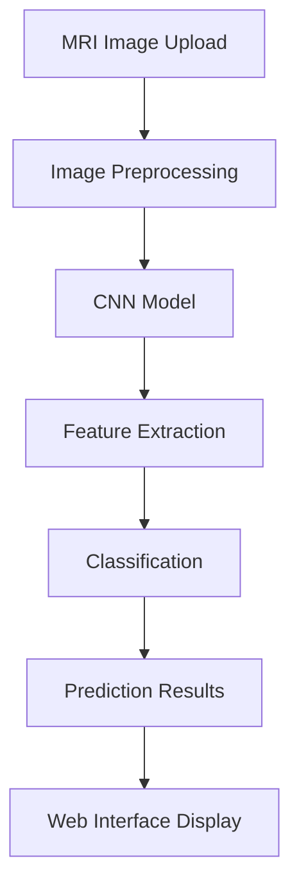

# 🧠 Brain Tumor Detection System

[](https://www.python.org/)
[](https://tensorflow.org/)
[](https://flask.palletsprojects.com/)

> An AI-powered medical imaging solution for automated brain tumor detection using deep learning and computer vision.

## 🎯 Project Overview

This project implements a **Convolutional Neural Network (CNN)** for automated brain tumor detection from MRI scans. The system combines deep learning techniques with an intuitive web interface for real-time image analysis.

### Key Features

- 🔬 **Binary Classification**: CNN model trained to distinguish between tumor and non-tumor brain scans
- 🌐 **Web-Based Interface**: User-friendly Flask application for image upload and analysis
- ⚡ **Real-Time Predictions**: Instant classification results
- 🛡️ **Image Preprocessing**: Automated resizing, normalization, and format conversion
- 📱 **Responsive Design**: Mobile-friendly interface with Bootstrap integration

## 🏗️ System Architecture



### Model Architecture

| Layer Type | Configuration | Activation | Purpose |
|------------|---------------|------------|---------|
| **Conv2D** | 32 filters, 3×3 kernel | ReLU | Initial feature extraction |
| **MaxPooling2D** | 2×2 pool size | None | Dimensionality reduction |
| **Conv2D** | 32 filters, 3×3 kernel | ReLU | Pattern recognition |
| **MaxPooling2D** | 2×2 pool size | None | Spatial downsampling |
| **Conv2D** | 64 filters, 3×3 kernel | ReLU | Complex feature detection |
| **MaxPooling2D** | 2×2 pool size | None | Final spatial reduction |
| **Flatten** | Convert to 1D | None | Convert 2D to 1D |
| **Dense** | 64 units | ReLU | High-level feature learning |
| **Dropout** | 0.5 rate | None | Overfitting prevention |
| **Dense** | 2 units | Softmax | Binary classification output |

**Architecture Flow**: Input (64×64×3) → Conv+Pool layers → Flatten → Dense layers → Output (2 classes)

## 🚀 Quick Start

### Prerequisites

- Python 3.7 or higher
- pip package manager
- 4GB+ RAM recommended

### Installation

1. **Clone the repository**
   ```bash
   git clone https://github.com/KAMRANKHANALWI/Tumor-Detection-System.git
   cd Tumor-Detection-System
   ```

2. **Create virtual environment** (recommended)
   ```bash
   python -m venv brain_tumor_env
   source brain_tumor_env/bin/activate  # Linux/Mac
   # or
   brain_tumor_env\Scripts\activate     # Windows
   ```

3. **Install dependencies**
   ```bash
   pip install -r requirements.txt
   ```

4. **Run the application**
   ```bash
   python app.py
   ```

5. **Access the web interface**
   ```
   http://127.0.0.1:5000
   ```

## 📊 Dataset & Training

### Dataset Structure
```
datasets/
├── no/     # Non-tumor brain scans
└── yes/    # Tumor-positive brain scans
```

### Training Configuration
- **Input Size**: 64×64×3 RGB images
- **Batch Size**: 16
- **Epochs**: 10
- **Optimizer**: Adam
- **Loss Function**: Categorical Cross-Entropy
- **Train/Test Split**: 80/20

## 💻 Usage

### Web Interface

1. **Upload Image**: Select an MRI brain scan (supported image formats)
2. **Preview**: Review the uploaded image before analysis
3. **Predict**: Click the "Predict!" button for instant analysis
4. **Results**: View classification results

## 🧪 Testing

### Run Model Tests
```bash
python mainTest.py
```

### Web Application Testing
1. Start the Flask server
2. Upload test images 
3. Verify prediction functionality

## 🔬 Technical Details

### Image Preprocessing Pipeline
1. **Format Conversion**: Convert to RGB color space
2. **Resizing**: Standardize to 64×64 pixels
3. **Normalization**: Scale pixel values using Keras normalize function

### Model Training Process
1. **Data Loading**: Load images from datasets/no and datasets/yes directories
2. **Preprocessing**: Image resizing and normalization
3. **Model Compilation**: Adam optimizer with categorical cross-entropy
4. **Training**: 10 epochs with train/test split
5. **Model Saving**: Export to HDF5 format

## 📋 Requirements

### Python Dependencies
```
tensorflow
keras
flask
opencv-python
pillow
numpy
scikit-learn
werkzeug
```

---

<div align="center">

**⭐ Star this repo if you found it helpful!**

</div>
